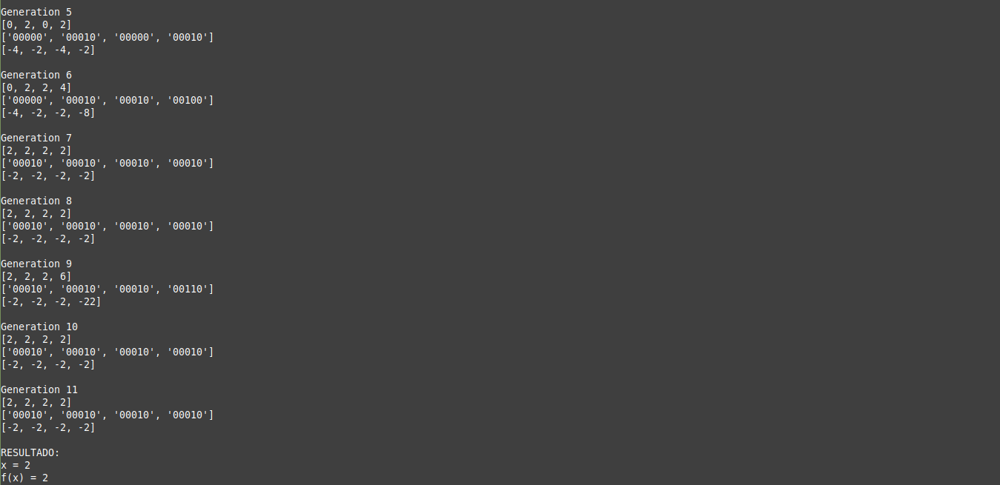

<h1 align="center">
  algoritmo-genetico
</h1>

<p align="center">
 <a href="#objetivo">Objetivo</a> •
 <a href="#mudando-valores-definidos">Mudando valores definidos</a> • 
 <a href="#passo-a-passo">Passo-a-passo</a> 
</p>

### Objetivo

<p> Este projeto foi feito com o objetivo de calcular um x para uma função f(x) de forma que f(x) seja um valor mínimo dentro de um intervalo especificado para os valores de x. O código utilizou o algoritmo genetico com crossover e mutação para chegar cada vez mais perto do mínimo da função.</p>

<p align="center">
  <h1 style="display: flex; flex-wrap: wrap;">
    
  </h1>
</p>

### Mudando valores definidos

O código Execution.py vem com os seguintes valores definidos:

- Intervalo para o x: [-10, 10]
- Probabilidade para o crossover: 80%
- Probabilidade para a multação: 1%
- Limite de gerações: 100
- Limite de gerações sequenciais sem melhora na aptidão: 10

Para alterar estes valores, mude os valores das variáveis no 'topo' do arquivo Execution.py

OBS.: O código Algorithm.py vem com a função f(x) definida, para alterar, mude o retorno da função 'function()' dentro do arquivo.

### Requisitos

Para rodar este jogo, você vai precisar ter instalado em sua máquina as seguintes ferramentas:
[Git](https://git-scm.com), [Python + pip](https://www.python.org/downloads/) e [virtualenv](https://virtualenv.pypa.io/en/latest/).

### Passo-a-passo

```bash
# Clone este repositório
$ git clone https://github.com/Daniel-Alencar/algoritmo-genetico

# Acesse a pasta do projeto no terminal/cmd
$ cd algoritmo-genetico

# Crie um ambiente virtual para instalar as dependências
$ virtualenv myENV

# Entre no ambiente virtual
$ source myENV/bin/activate

# Instale as dependências
$ pip3 install -r requirements.txt

# Execute a aplicação
$ python3 Execution.py
```
